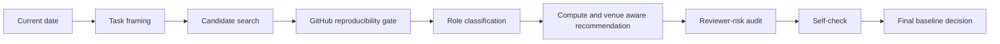

# Baseline Selector

Choose baselines like a serious paper author, not like someone scrolling citations at 2 a.m.

`baseline-selector` is a Codex skill for turning a research idea, task, paper draft, or experiment plan into a defensible baseline decision. It searches for classic anchors, recent strong methods, reviewer-expected comparisons, and practical open-source baselines, then filters them through a hard GitHub reproducibility gate before recommending what to actually run.

## First-screen example

```text
Input:
I have an LLM agent memory idea.
Target venue: ICML 2027.
Compute budget: 4x A100 for 5 days.
Time budget: 2 weeks.
Task: long-horizon agent tasks with memory and tool use.

Output:
- classic anchors
- latest reproducible baselines
- excluded no-code or unrunnable SOTA papers
- compute-aware recommendation
- reviewer-risk audit
- self-check before final baseline decision
```

## Why this exists

Most baseline selection is messy.

People usually do some combination of:
- picking famous papers from memory
- copying a related-work section
- trusting a leaderboard row without checking code
- over-selecting methods they cannot actually run
- forgetting what reviewers will immediately ask for

`baseline-selector` turns that into a more rigorous workflow:
- real search date and freshness windows
- real venue and year for each selected baseline
- GitHub code gate before selection
- compute-aware recommendations
- explicit excluded-method records
- self-check before the final recommendation

## Core workflow



## Before and after

### Typical baseline selection

- citation-driven
- unclear freshness
- no venue/year audit
- no code verification
- no compute filter
- no exclusion log
- no self-check

### With `baseline-selector`

- time-stamped search
- venue and year recorded
- GitHub reproducibility gate
- budget-aware recommendation
- excluded but relevant papers tracked
- reviewer-risk audit
- self-check before the final set

## What makes it different

- No usable GitHub implementation, no selected baseline.
- Every selected baseline records the real publication venue and year.
- "Latest" means latest as of a real date, not vague model memory.
- Final recommendations require a target venue/year and compute budget.
- Repositories can be scored by reproducibility quality, not just labeled code/no-code.
- Output can switch by user profile: paper submission, fast prototype, limited compute, industry comparison, or rebuttal emergency.
- Search can route by domain conventions instead of pretending every field chooses baselines the same way.
- Excluded methods still get recorded when they matter for related work or reviewer expectations.

## Required user inputs

```text
research idea / task
domain
dataset or benchmark
metric
target venue and year
compute budget / hardware limit
time budget
implementation constraints
output profile (optional but useful)
```

Examples of target venue input:

- `ICML 2027`
- `NeurIPS 2028`
- `CVPR 2027`
- `ACL 2026`

Examples of compute input:

- `4x A100 for 5 days`
- `1x 4090 for 4 days`
- `inference-only for API baselines`

## Output structure

```text
baseline_selection/
|- 01_task_definition.md
|- 02_search_strategy.md
|- 03_candidate_baselines.md
|- 04_excluded_nonreproducible.md
|- 05_recommended_baseline_sets.md
|- 06_reproduction_plan.md
|- 07_reviewer_risk_check.md
|- 08_self_check.md
`- 09_final_decision.md
```

## Quick start

```text
Use $baseline-selector to choose baselines for my idea.
Target venue: ICML 2027.
Compute budget: 4x A100 for 5 days.
Time budget: 2 weeks.
Task: long-context multimodal retrieval.
Dataset: MSR-VTT.
Metric: R@1.
Output profile: paper submission mode
```

Profile examples:

- `paper submission mode`
- `fast prototype mode`
- `limited compute mode`
- `industry comparison mode`
- `rebuttal emergency mode`

## Installation

### Windows

```powershell
git clone https://github.com/<your-name>/baseline-selector.git "$env:USERPROFILE\.codex\skills\baseline-selector"
```

### macOS / Linux

```bash
git clone https://github.com/<your-name>/baseline-selector.git ~/.codex/skills/baseline-selector
```

Then restart Codex or open a new session.

## Repository layout

```text
.
|- SKILL.md
|- agents/
|- references/
|- templates/
|- examples/
|- evals/
`- README.md
```

## Design principles

- Evidence before recommendation.
- GitHub reproducibility before selection.
- Venue-aware and compute-aware recommendations.
- Explicit handling of excluded but relevant papers.
- Self-check before the final answer.

## License

MIT.
